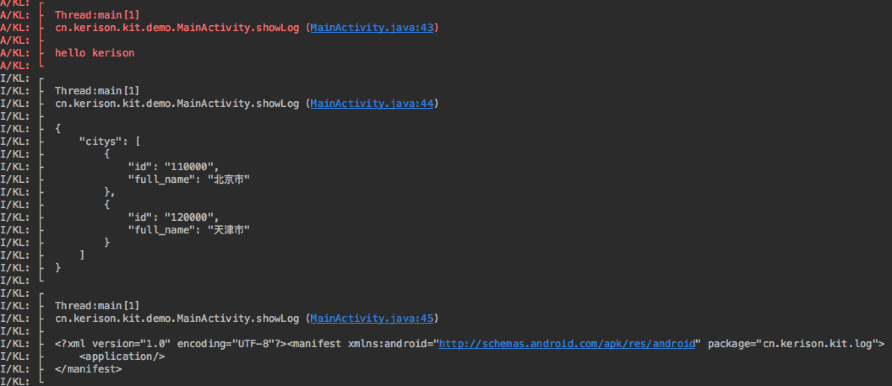

## KLog
Android上一个简单易用的Log日志库
- 支持自定义Tag
- 支持自定义输出样式
- 支持输出线程
- 支持输出调用的方法名 文件名 包名 行数
- 支持输出调用栈层级
- 支持屏蔽日志

[](https://jitpack.io/#GKerison/KLog)

## KLog TODO :ear_of_rice:

- [ ] 更方便的Log配置
- [ ] 无参数的情况支持

## KLog Usages

1. 项目的build.gradle增加JitPack repository
```
allprojects {
  repositories {
    ...
    maven { url "https://jitpack.io" }
  }
}
```
2. 模块的build.gradle增加dependency
````
dependencies {
    compile 'com.github.GKerison:KLog:2.0.0'
}
````
## 栗子

```
KL.disable();//禁用log
KL.config().setTag("GK").setMethodCount(1);//配置log
KL.config().hideExtraInfo();//隐藏线程、方法栈等信息
String name = "kerison";
String json = " {\"citys\": [\n" +
"        {\n" +
"          \"id\": \"110000\",\n" +
"          \"full_name\": \"北京市\"\n" +
"        },\n" +
"        {\n" +
"          \"id\": \"120000\",\n" +
"          \"full_name\": \"天津市\"\n" +
"        }\n" +
"      ]}";

String xml = "<manifest package=\"cn.kerison.kit.log\"\n" +
"          xmlns:android=\"http://schemas.android.com/apk/res/android\">\n" +
"    <application />\n" +
"</manifest>\n";

KL.v("hello %s ", name);
KL.d("hello %s ", name);
KL.i("hello %s ", name);
KL.w("hello %s ", name);
KL.e("hello %s ", name);
KL.wtf("hello %s ", name);
KL.json(json);
KL.xml(xml);
```

## KLog ScreenShot
个人使用的时候，建议配合自定义自己喜欢的Console的Log颜色和字体，打印出来的效果更明显。
Setting > Editor > Colors&Fonts

