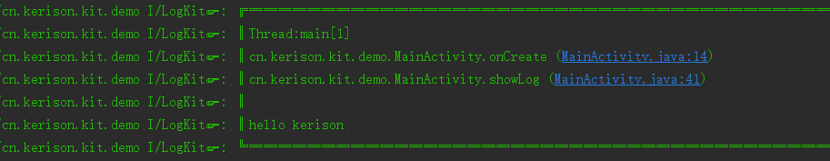
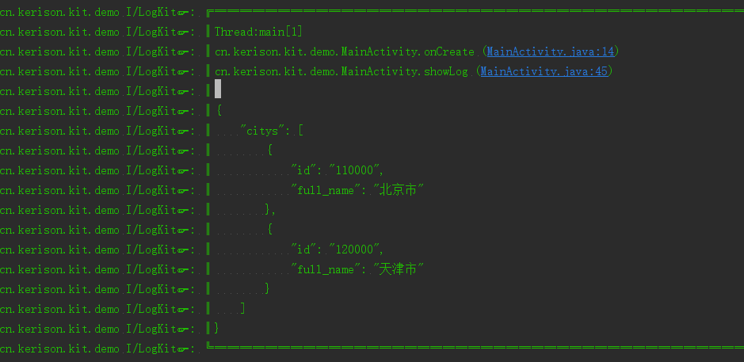
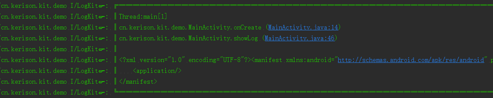

# KLog 
a kit for android log

[ ](https://bintray.com/kerison/maven/KLog/_latestVersion)

# KLog Usages

````
dependencies {
 compile 'cn.kerison:klog:1.0.0'
}
````

```
KL.disable();//禁用log
KL.config().setTag("GK").setMethodCount(1);//配置log
KL.config() .hideExtraInfo();//隐藏线程、方法栈等信息
String name = "kerison";
String json = " {\"citys\": [\n" +
"        {\n" +
"          \"id\": \"110000\",\n" +
"          \"full_name\": \"北京市\"\n" +
"        },\n" +
"        {\n" +
"          \"id\": \"120000\",\n" +
"          \"full_name\": \"天津市\"\n" +
"        }\n" +
"      ]}";

String xml = "<manifest package=\"cn.kerison.kit.log\"\n" +
"          xmlns:android=\"http://schemas.android.com/apk/res/android\">\n" +
"    <application />\n" +
"</manifest>\n";

KL.v("hello %s ", name);
KL.d("hello %s ", name);
KL.i("hello %s ", name);
KL.w("hello %s ", name);
KL.e("hello %s ", name);
KL.wtf("hello %s ", name);
KL.json(json);
KL.xml(xml);
```

# KLog ScreenShot






